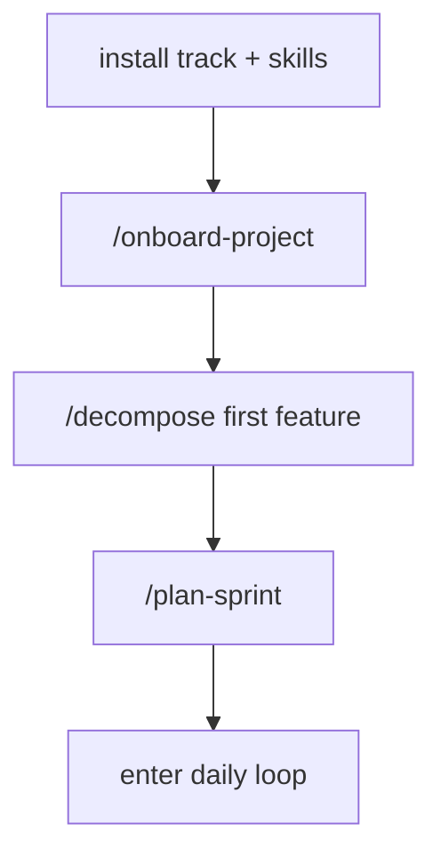
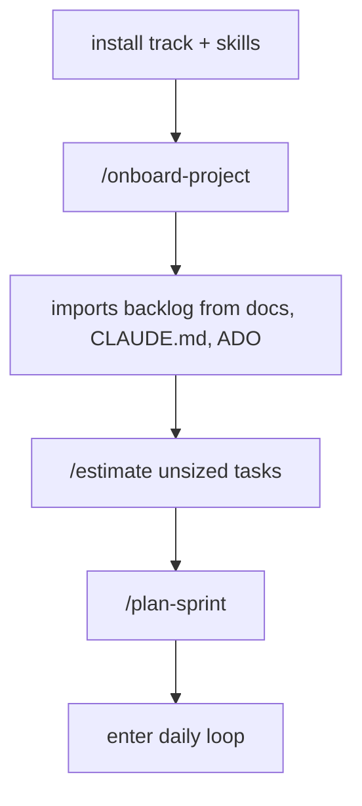
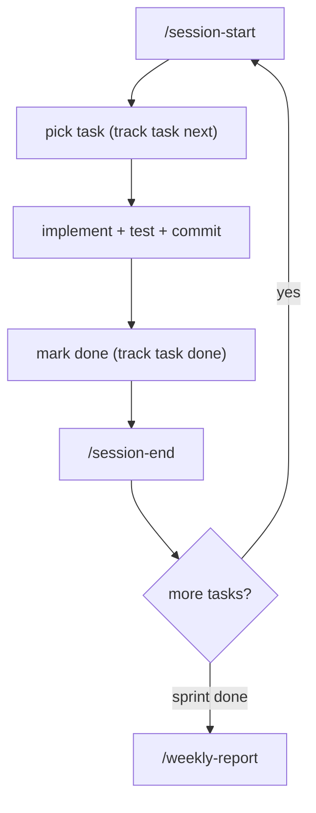
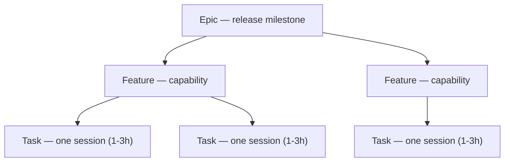

# Track

A CLI project management tool built for AI-assisted development workflows. Designed to be used alongside Claude Code (or any LLM coding agent) via MCP, REST API, or direct CLI.

## Features

- **Task management** — hierarchical tasks with epics/features/tasks, priorities, dependencies, and status tracking
- **Sprint planning** — time-boxed sprints with capacity estimation and velocity tracking
- **Session tracking** — log development sessions with start/end times and stats
- **ADO sync** — bi-directional Azure DevOps integration (pull work items, push status changes)
- **Knowledge capture** — decisions, learnings, and blockers linked to tasks
- **Reports** — sprint reports, velocity charts, dependency graphs, critical path analysis
- **MCP server** — expose task operations to LLM agents via Model Context Protocol
- **Web UI** — kanban board, tree view, session timeline (served locally)

## Getting Started

### 1. Install track

```bash
go install github.com/RunOnYourOwn/track@latest   # or @v0.1.0 to pin a release
```

Or grab a prebuilt binary (linux/macOS, amd64/arm64) from the
[Releases](https://github.com/RunOnYourOwn/track/releases) page, or build from source:

```bash
git clone https://github.com/RunOnYourOwn/track.git
cd track
make install   # builds + installs ./track to ~/bin (plain `go build -o track .` also works)
```

Check the build with `track --version`; see [CHANGELOG.md](CHANGELOG.md) for release history.

### 2. Install the skills

```bash
cp -r skills/*/ ~/.claude/skills/
```

This gives your agent `/onboard-project`, `/session-start`, `/session-end`, `/plan`, `/decompose`, `/estimate`, `/plan-sprint`, `/parallel-sprint`, `/timeline`, and more. See [skills/README.md](skills/README.md) for the full list.

### 3. Onboard your project

```bash
# In your project directory:
/onboard-project
```

This is a **guided walkthrough** — the agent discovers your existing work (sprint docs, CLAUDE.md backlog, session notes), proposes a project structure (prefix, epics, features), and confirms each step before executing. Nothing is created until you approve it.

Or set up manually:

```bash
track project create MYPROJ "My Project" --methodology build
```

### 4. Configure MCP (optional — for direct agent tool access)

Add to your Claude Code settings (`~/.claude/settings.json` or project `.mcp.json`):

```json
{
  "mcpServers": {
    "track": {
      "command": "track",
      "args": ["mcp"]
    }
  }
}
```

This exposes task CRUD, sprint operations, sessions, and knowledge capture as MCP tools your agent can call directly.

### 5. Start working

```bash
/session-start    # Orient: board state, blockers, next task
# ... work ...
/session-end      # Log time, update notes, write next steps
```

### 6. Serve the web UI (optional)

```bash
track serve
# Open http://localhost:3011 — kanban board, tree view, session timeline
```

## Workflows

Track ships with [Claude Code skills](skills/) that automate the full project management loop. Three scenarios cover the lifecycle:

### Scenario 1: New Project



`/onboard-project` is interactive — it asks about your goals, proposes a project structure (prefix, epics, features), and confirms before creating anything. Then decompose your first feature into tasks, plan a sprint, and start working.

### Scenario 2: Existing Project



`/onboard-project` detects existing work (sprint-tasks.md, CLAUDE.md backlog, ADO items, session notes), proposes how to organize it into epics/features/tasks, and confirms before importing.

### Scenario 3: Daily Loop (Active Project)



This is steady-state. Skills fire additional flows as needed:

| Trigger | Skill | What it does |
|---------|-------|-------------|
| Start of week | `/plan-sprint` | Select + sequence tasks by capacity |
| Tasks ready in parallel | `/parallel-sprint` | Execute in git worktrees |
| Next feature ready to build | `/decompose` | Feature → sized tasks |
| Tasks lack estimates | `/estimate` | Bulk T-shirt sizing + hours |
| New feature idea | `/plan` | Explore codebase → task list |
| End of week | `/weekly-report` | Velocity, blockers, next week |
| Standup or check-in | `/project-status` | Cross-project dashboard |
| Stakeholder asks "when?" | `/timeline` | Forecast completion dates |
| Milestone or code quality gate | `/deep-audit` | Multi-phase codebase audit |

### Task Hierarchy



Epics are release milestones (POC, MVP1, Production). Features are user-facing capabilities. Tasks are the unit of work — sized to fit one coding session. `/decompose` creates tasks from features on-demand (not all upfront).

## Configuration

### Project CLAUDE.md (required for skills)

Skills read your project's `CLAUDE.md` to know which track project to operate on. Add a `## Taskboard` section:

```markdown
## Taskboard
Project: MYPROJ (ID: <ulid from track project create>)
```

### Session Notes (created automatically)

The `/session-end` skill writes `docs/session-notes/current.md` to persist state between sessions:

```markdown
# Current Session

**Date:** 2025-01-15
**Active branch:** feature/auth
**Phase:** Build — implementing OAuth flow

## Next steps
1. Finish token refresh logic
2. Add integration test for expired tokens
3. Wire up logout endpoint
```

### ADO Sync (optional)

If syncing with Azure DevOps, create `~/.track/ado.json`:

```json
{
  "organization": "your-org",
  "sync": [
    {
      "project": "YourAdoProject",
      "team": "Your Team",
      "track_project": "MYPROJ",
      "area_path": "YourAdoProject\\TeamArea"
    }
  ]
}
```

Set your PAT via environment variable:

```bash
export TRACK_ADO_PAT="your-personal-access-token"
```

## CLI Reference

```bash
# Project
track project create/list/get

# Tasks
track task create/move/done/list/get/next/delete/link

# Sessions
track session start/end/log

# Sprints
track sprint create/add/remove/start/complete/list/tasks

# Reports
track report status/velocity/health/snapshot

# Knowledge
track decision create/list/resolve
track learning create/search
track blocker create/list/resolve

# ADO Sync (optional)
track ado pull/push/config/status

# MCP Server
track mcp

# Web UI
track serve
```

## Architecture

```
cmd/          CLI commands (cobra)
internal/
  db/         SQLite persistence layer
  ado/        Azure DevOps client + sync logic
  mcp/        MCP server handlers
  models/     Shared types
web/
  static/     Embedded web UI (kanban, tree, sessions)
  api/        REST handlers
skills/       Claude Code skills for workflow automation
docs/         Workflow guide (workflow.html)
```

## License

[MIT](LICENSE)
